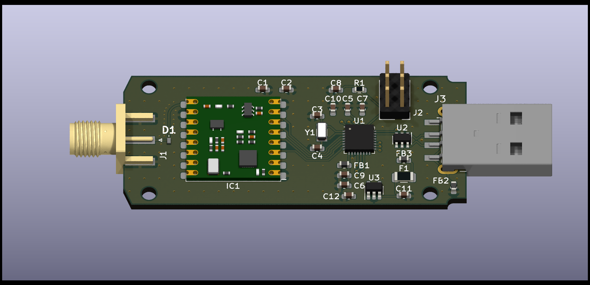
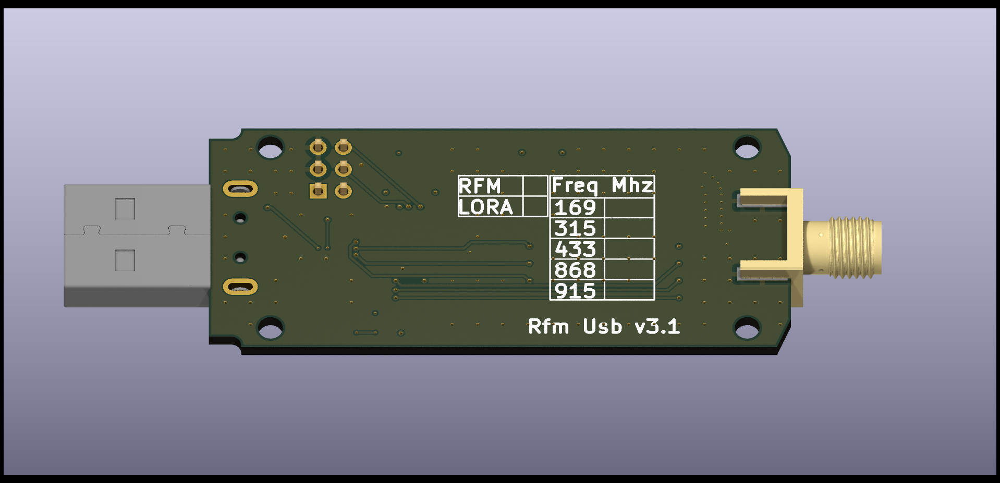
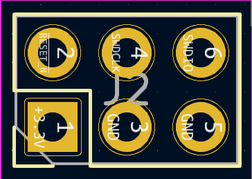

# Whats is an RfmUsb Adapter

An RfmUsb is a USB 2.0 device that exposes the functions of the Hope RFM69 radio modules over a serial command line interface. It can be used with any modern OS as it enumerates as a standard CDC usb device.

## Hardware Overview

The RfmUsb device supports the RFM69HCW radio module. An ATSAMD21E18A mcu performs USB and CLI processing functions.

_\* A future version may support the RFM95 module which is an FSK/OOK and Lora capable radio_

### RM69HCW Module Specifications

* +20 dBm - 100 mW Power Output Capability
* High Sensitivity: down to -120 dBm at 1.2 kbps
* High Selectivity: 16-tap FIR Channel Filter
* Bullet-proof front end: IIP3 = -18 dBm, IIP2 = +35 dBm,80
dB Blocking Immunity, no Image Frequency response
* Low current: Rx = 16 mA, 100nA register retention
* Programmable Pout: -18 to +20 dBm in 1dB steps
* Constant RF performance over voltage range of module
* FSK Bit rates up to 300 kb/s
* Fully integrated synthesizer with a resolution of 61 Hz
* FSK, GFSK, MSK, GMSK and OOK modulations
* Built-in Bit Synchronizer performing Clock Recovery
* Incoming Sync Word Recognition
* 115 dB+ Dynamic Range RSSI
* Automatic RF Sense with ultra-fast AFC
* Packet engine with CRC-16, AES-128, 66-byte FIFO
Built-in temperature sensor

Full RFM69 Specification [RFM69HCW](https://www.hoperf.com/modules/rf_transceiver/RFM69HCW.html)

### Supported Frequencies

* 315 Mhz
* 433 Mhz
* 868 Mhz
* 915 Mhz

*\* Dependant on module variant installed on the RfmUsb board*

### Front View

### Back View

### Protective Case

### Connectors

Connector | Description
---------|----------
 J1 | 50 Ohm SMA female connector
 J2 | 6 way 2.54mm pitch ISP header (not populated)
 J3 | USB 2.0 Type A

#### ISP Header

The in system programming header (ISP) can be used to flash the device with a boot loader or full flash image. It can also be used with an appropriate debugger to debug application code on the device.

Pin | Name | Function
---------|----------|---------
 1 | VCC | Power supply ground 3.3v
 2 | RESET | Active low reset
 3 | GND | Power supply ground
 4 | SWDCLK | Serial Wire Debug Clock.
 5 | GND | Power supply ground
 6 | SWDIO | Serial Wire Debug Data Input/Output

## Firmware Update

The firmware on the device can be updated via the UF2 boot loader that is installed on the RfmUsb device. The boot loader can be entered by two mechanisms, via a a cli command or via a double reset. A double reset of the device will enter the UF2 boot loader. A double reset can be performed by plugging the device into a usb port and connecting the RESET (Pin 2) on the ISP port to GND (PIN 3 or 5).

## Serial Device Configuration

When the device is plugged into a modern operating system it will be enumerated as a CDC Usb serial device and assigned a com port number from the operating system. The following configuration can be used when connecting to the serial device:

Setting | Setting
---------|----------
 Baud Rate | 1200 - 230400
 Data Bits | 8
 Parity | None
 Stop Bits | 1

### Serial Terminal Applications

Windows: [coolterm](https://freeware.the-meiers.org/)

Linux: [minicom]( https://linux.die.net/man/1/minicom)

## Command Line Instructions

When the device is connected to with a serial console application the CLI command **help** retrieves the full list of available CLI commands. CLI Commands are terminated by either a CR or LF character. A CR or LF character entered will repeat the last CLI command.

### CLI Execution

When a CLI command executes successfully the device responds with an _**OK**_. When a CLI command parameter or execution fails the device will return an error response.

### CLI Parameters

A number CLI commands have required parameters, these are denoted in the command help description.

For example **_s-br Set bit rate: 1200-300000_**

The CLI commands will accept parameters in either decimal or hexadecimal format.

Optional CLI command parameters are denoted with square braces surrounding the parameter.

For example **_e-tx Execute tx: hex [tx count: 1 - 20] [tx interval: 10 - 1000] [timeout: 10 - 5000]_**. tx count, tx interval and timeout are all optional arguments.

A number of CLI commands require hexadecimal parameters. These are denoted with the following syntax **_hex (min - max)_**. The minimum and maximum values specify the hex minimum and maximum string length.

An example CLI command that accepts a hex string value as a parameter **_s-sync AA55BE_**

Most CLI commands are simple getter setter type commands for example:

**_g-om Get operating mode_**

**_s-om Set operating mode: 0-5_**

### CLI DIO Commands

The Rfm69 device has a number of digital IO pins (DIO) these pins are used to signal to the MCU the internal state of the packet engine. The MCU will signal state changes to the connected serial console when the state of one of the DIO pins changes.

First the DIO mapping needs to be set see Section 5.3.2 of the RFM69HCW specification of the configurations.

Set the DIO0 line mapping to Mapping 0:

**_s-dio 0 0_**

The response to this CLI command is as follows:

**_OK-[0x0003]-Map 03_**

This will enable the DIO0 line to signal CrcOk Irq state change in RX mode. In Tx mode the DIO0 line will signal PacketSent Irq state change.

The DIO interrupt mask must be set to enable the interrupt to be signalled to the client serial console application.

**_s-dim 1_**

When the DIO Irq occurs the serial console will be notified with a DIO IRQ PIN interrupt.

**_DIO PIN IRQ [0x01]_**

### CLI Irq Flags Command

g-irq   Get irq flags
s-irq   Set irq flags. 010-0x0910

### CLI Tx Command

e-tx    Execute tx: hex(1-64) [tx count: 1 - 20] [tx interval: 10 - 1000] [timeout: 10 - 5000]

### CLI Buffered Io Command

r-b     Read io buffer: [count: 1-256]
w-b     Write io buffer: hex (1-64)
e-btx   Execute io buffer transmit
